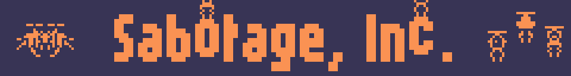
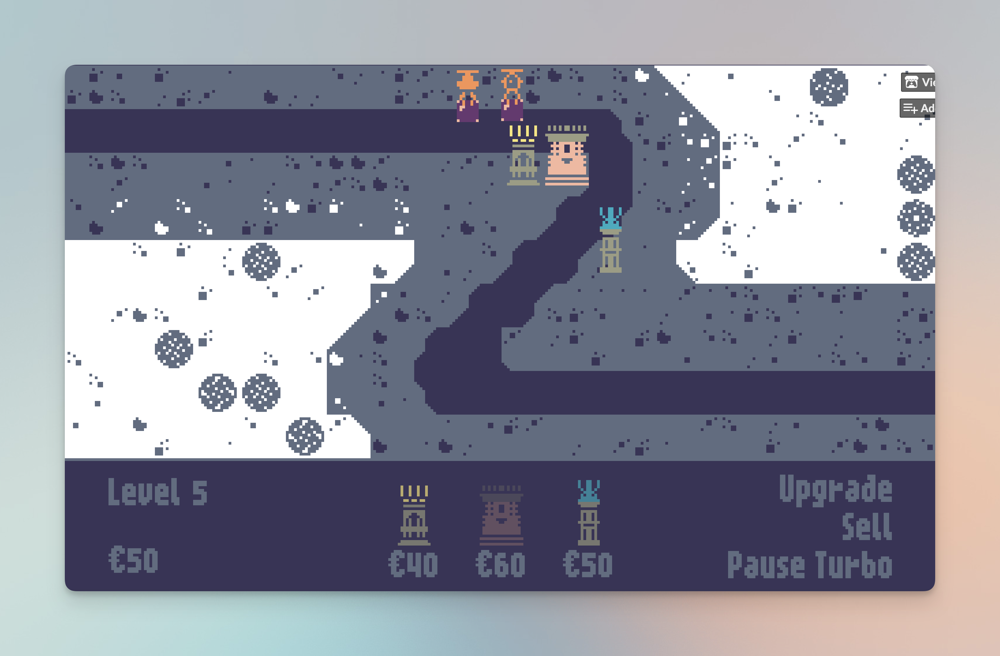
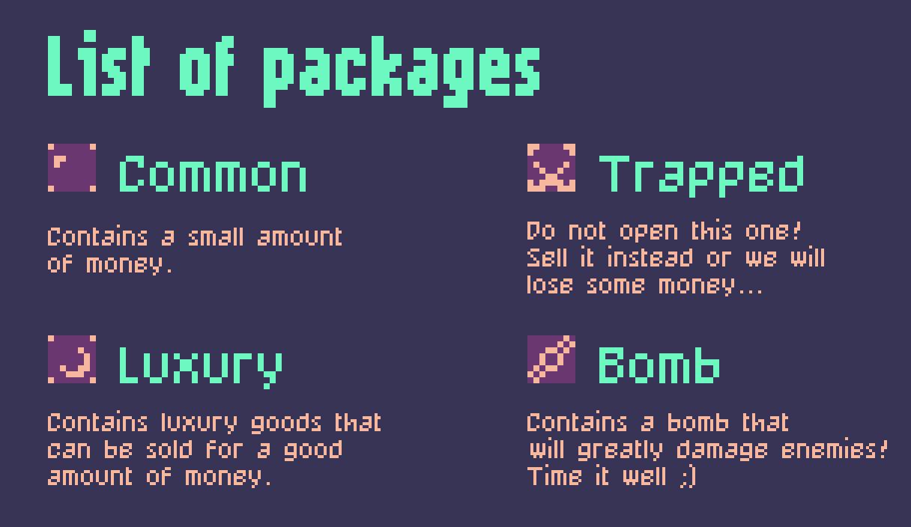
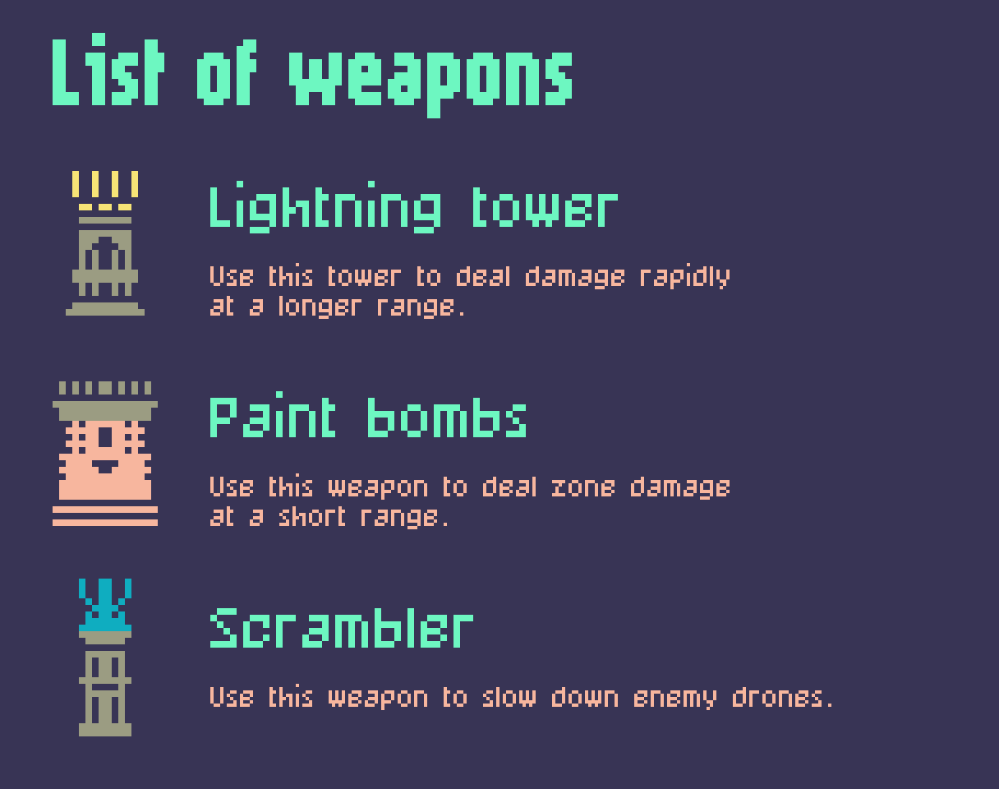

    

  

    

> Welcome to Sabotage, Inc.!
>
> We need you to try our latest technology to hijack delivery drones. 😈
>
> We have spotted six sensitive spots where packages must be intercepted at all costs. 👾📦

    

> To fulfill our goals, you can use the following weapons:

    

## Controls

- Upgrade/sell: Click on upgrade/sell and then on a tower
- Click on a package: opens the package
- Click on sell and then on a package: sells the package
- Space: pause
- M: mute

## The team

- @adorikill ([twitter](twitter.com/Dorille_)): Pixel Art
- @jmen-balec ([soundcloud](soundcloud.com/jmen_balec)): BGM, SFX
- @hadri ([github](github.com/hadrienrenaud)): Code (IntelliJ IDEA 2023.1, Rust, Bevy)
- @yopox ([mastodon](mstdn.social/@yopox), [github](github.com/yopox)): Code (CLion 2023.1.2, Rust, Bevy)